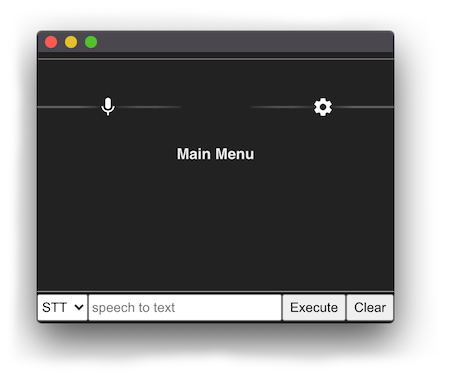

## Developer Installation

#### 1. Install NodeJS and Yarn and dependencies

* Install [NodeJS](https://nodejs.org/en/), v13 or higher
* Install [Yarn](https://classic.yarnpkg.com/en/docs/install) package manager, v1.12.3 or higher
* Ubuntu: `sudo apt install xz-utils curl libasound2-dev git build-essentials libstdc++6`

#### 2. Clone this repository

```
git clone https://github.com/pia-im/pia-electron-client
cd pia-electron-client
yarn install
yarn run rebuild
```

#### 3. Start Pia

#### 4. Start the app

```
yarn run dev
```

The console like this should load it up.



The app will start at the main menu with no assistants running by default.

#### 5. (Optional) Production Build

The `dist` command will produce a packaged version of the app in the `/dist` directory.

```
yarn run dist
```
